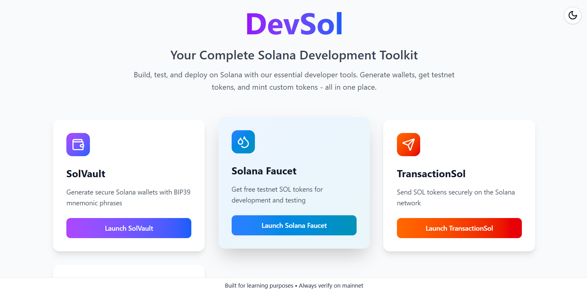

# DevSol �

<div align="center">
  <strong>Complete Solana Development Toolkit built with React and Vite</strong>
  <br><br>
  
  
  
  
</div>

<br>

DevSol is a comprehensive Solana development toolkit that provides essential tools for wallet generation, token distribution, transactions, and token minting - all in one place.

> **Note**: This project was built as part of a development assignment to demonstrate Solana blockchain integration and modern web development practices.

## Screenshot

<div align="center">
  
  <br>
  <em>DevSol Landing Page showcasing all available tools</em>
</div>

## Features

### 🏦 SolVault

- 🔑 Generate new Solana wallets with BIP39 mnemonic phrases
- 📥 Import existing wallets using seed phrases
- 👁️ Toggle visibility for sensitive information
- 📋 Copy wallet details to clipboard
- 💰 Check wallet balance on Solana devnet

### � Solana Faucet

- 🪣 Request free testnet SOL tokens
- ⚡ Quick airdrop for development testing
- 📊 Display wallet balance after requests

### 💸 TransactionSol

- 🚀 Send SOL tokens securely
- 🎯 Input validation and error handling
- ✅ Transaction confirmation and signatures
- 💡 Helpful tooltips for disabled states

### 🎨 Mintify (Coming Soon)

- 🪙 Create and mint custom SPL tokens
- ⚙️ Token configuration and metadata
- 🔧 Advanced token management features

### 🌙 Additional Features

- 🌓 Dark/Light mode toggle
- 📱 Fully responsive design
- 🔒 Security-focused with best practices
- 🎨 Modern UI with smooth animations

## Tech Stack

- **React** - Frontend framework
- **Vite** - Build tool and development server
- **Tailwind CSS** - Styling and responsive design
- **@solana/web3.js** - Solana blockchain interaction
- **@solana/wallet-adapter-react** - Wallet integration
- **bip39** - Mnemonic phrase generation and validation
- **bs58** - Base58 encoding for Solana addresses
- **Buffer** - Browser polyfill for Node.js Buffer
- **Lucide React** - Modern icon library

## Installation

1. Clone the repository:

```bash
git clone https://github.com/riteshkrkarn/DevSol.git
cd DevSol
```

2. Install dependencies:

```bash
npm install
```

3. Start the development server:

```bash
npm run dev
```

4. Open your browser and navigate to `http://localhost:5173`

## Usage

### SolVault

1. **Generate New Wallet**: Leave the input field blank and click "Generate" to create a new wallet
2. **Import Existing Wallet**: Enter your BIP39 mnemonic phrase in the input field and click "Generate"
3. **View Seed Phrase**: Click "Show" to reveal your mnemonic words
4. **Copy Details**: Use the copy buttons to copy seed phrase, public key, or private key
5. **Check Balance**: The balance will be automatically fetched for imported wallets

### Solana Faucet

1. **Connect Wallet**: Click "Connect Wallet" to connect your Solana wallet
2. **Request Airdrop**: Enter the amount of SOL tokens to request (up to 2 SOL)
3. **Check Balance**: View your updated balance after the airdrop

### TransactionSol

1. **Connect Wallet**: Click "Connect Wallet" to connect your Solana wallet
2. **Enter Details**: Input recipient's public key and amount to send
3. **Send Transaction**: Click "Send SOL" to execute the transaction
4. **View Confirmation**: See transaction signature and success message

## Security Features

- Seed phrases are hidden by default
- Private keys are masked with dots and require manual reveal
- Security warnings and best practices are displayed
- No data is stored or transmitted to external servers

## Project Structure

```
DevSol/
├── src/
│   ├── solVault/
│   │   ├── Vault.jsx     # Wallet generation and management
│   │   └── ...
│   ├── solDrop/
│   │   ├── Faucet.jsx    # SOL token faucet
│   │   ├── Balance.jsx   # Balance display
│   │   └── ...
│   ├── transactionSol/
│   │   ├── TransactionSol.jsx  # Main transaction page
│   │   └── sendTokens.jsx      # Send SOL functionality
│   ├── components/
│   │   └── SecretPhraseGrid.jsx
│   ├── utils/
│   │   └── wallet.js     # Wallet utilities
│   ├── App.jsx           # Main application routing
│   ├── Landing.jsx       # Landing page
│   ├── index.css         # Tailwind CSS imports
│   └── main.jsx          # Application entry point
├── README.md
└── package.json
```

## Scripts

- `npm run dev` - Start development server
- `npm run build` - Build for production
- `npm run preview` - Preview production build
- `npm run lint` - Run ESLint

## Contributing

1. Fork the repository
2. Create a feature branch (`git checkout -b feature/amazing-feature`)
3. Commit your changes (`git commit -m 'Add some amazing feature'`)
4. Push to the branch (`git push origin feature/amazing-feature`)
5. Open a Pull Request

## Disclaimer

⚠️ **This application is built for learning purposes as part of a development assignment.**

- Always verify transactions on mainnet
- Never share your seed phrase or private keys
- Use at your own risk for actual funds
- Test thoroughly before using with real assets

## Author

**Ritesh Kumar Karn**

- 🐦 Twitter: [@riteshkrkarn](https://twitter.com/riteshkrkarn)
- 💼 LinkedIn: [riteshkrkarn](https://linkedin.com/in/riteshkrkarn)
- 🐙 GitHub: [riteshkrkarn](https://github.com/riteshkrkarn)
- 📧 Email: riteshkumarkarn414@gmail.com

## Credits

- Logo generated using **Google Gemini AI**
- Built with React + Vite template
- Icons by Lucide React

## License

This project is open source and available under the [MIT License](LICENSE).
